Source: https://youtube.com/playlist?list=PLliXbzY3XhUSJy3izXH-0ojiT3Uup8xbu&si=vH1nejKyL1Y1nERX

## 1. Insertion Sort
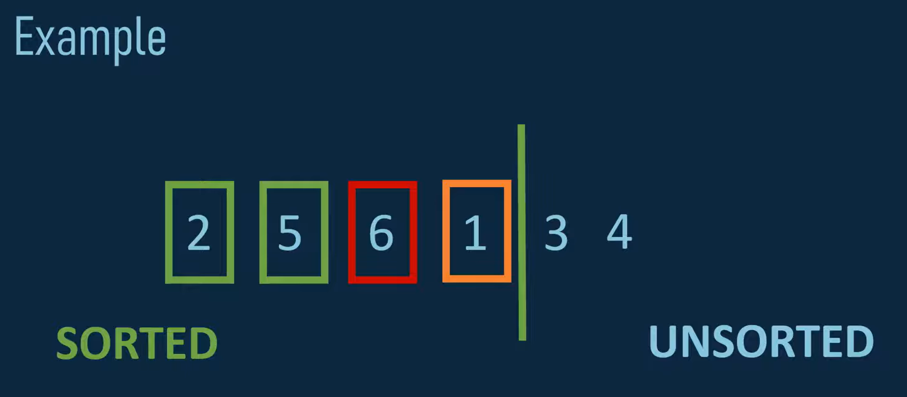

## 2. Selection Sort
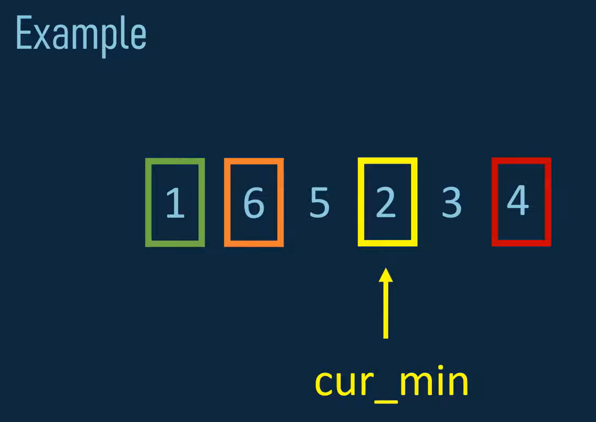

## 3. Merge Sort
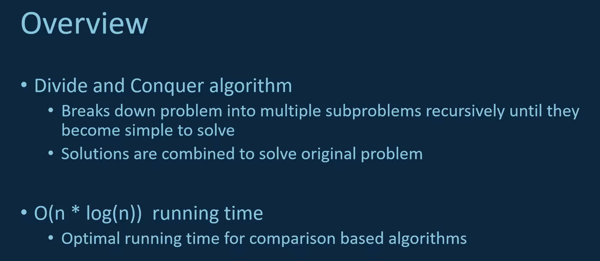
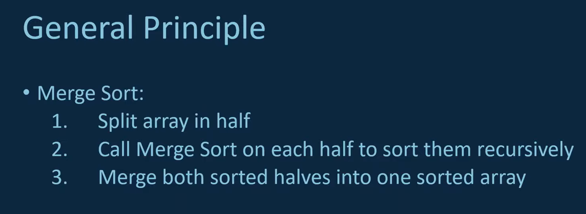
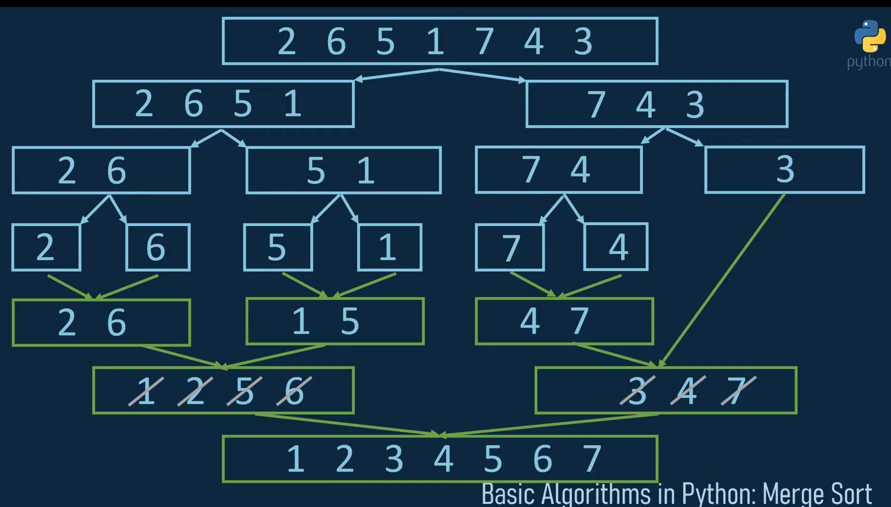

## 4. Quick sort
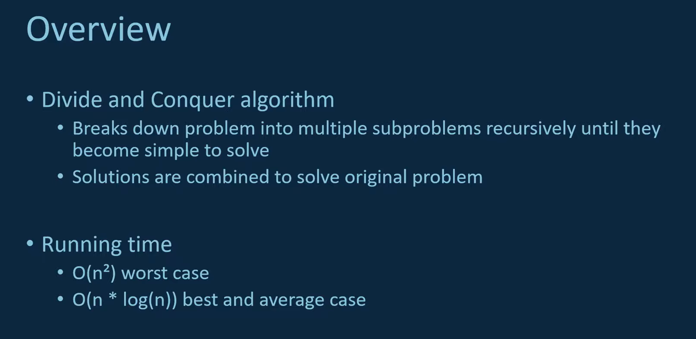
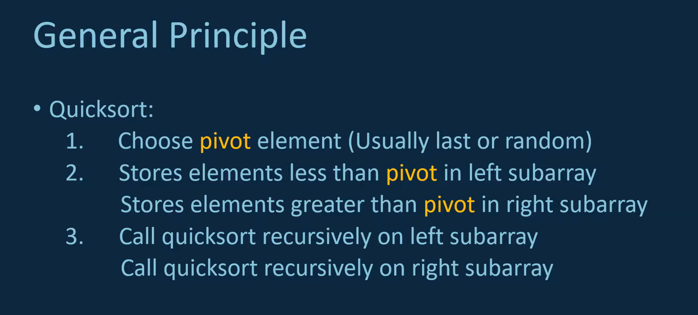
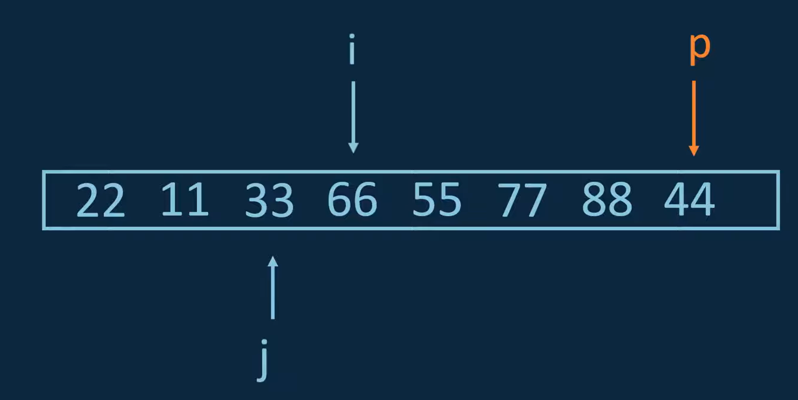
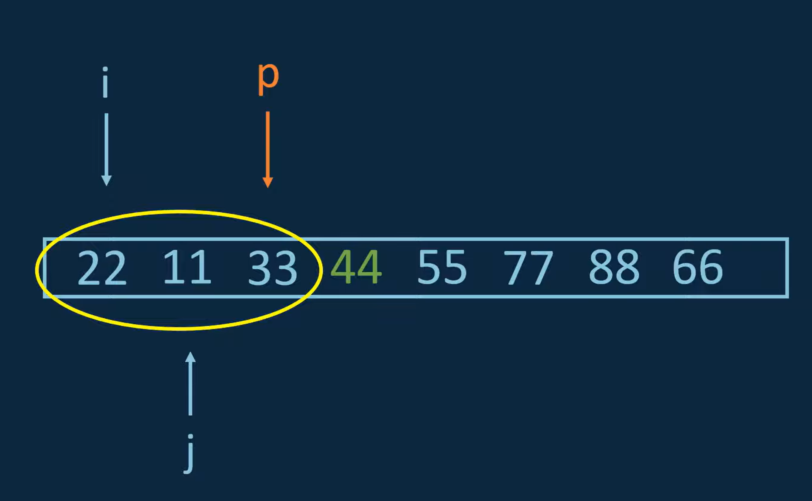
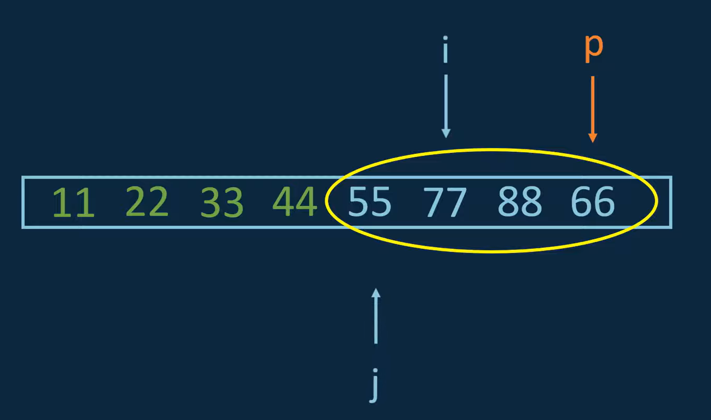

## 5. Breadth First Search (BFS)
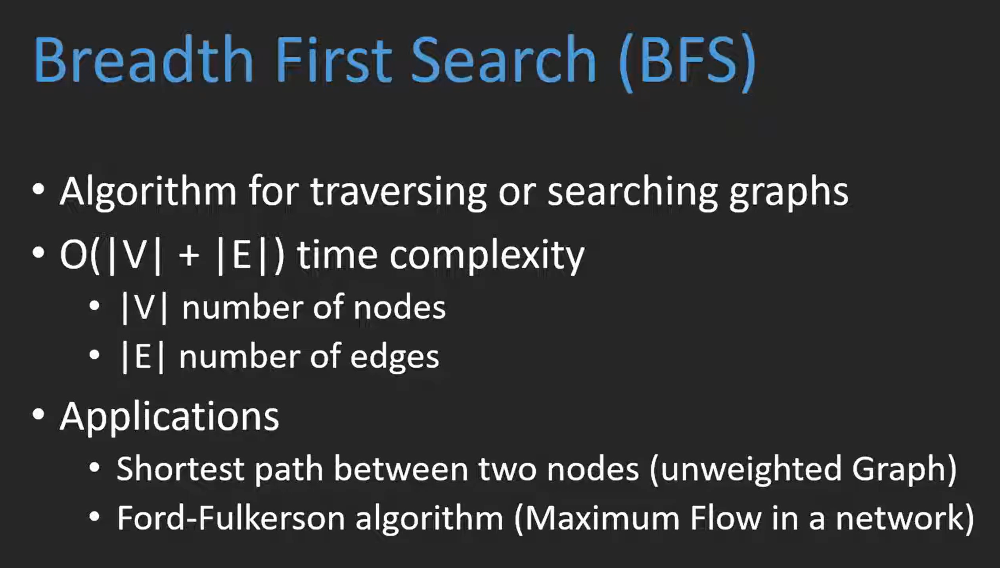
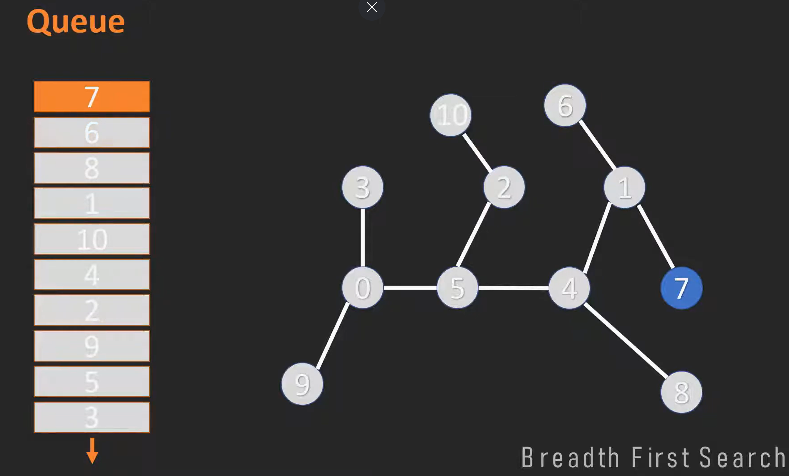
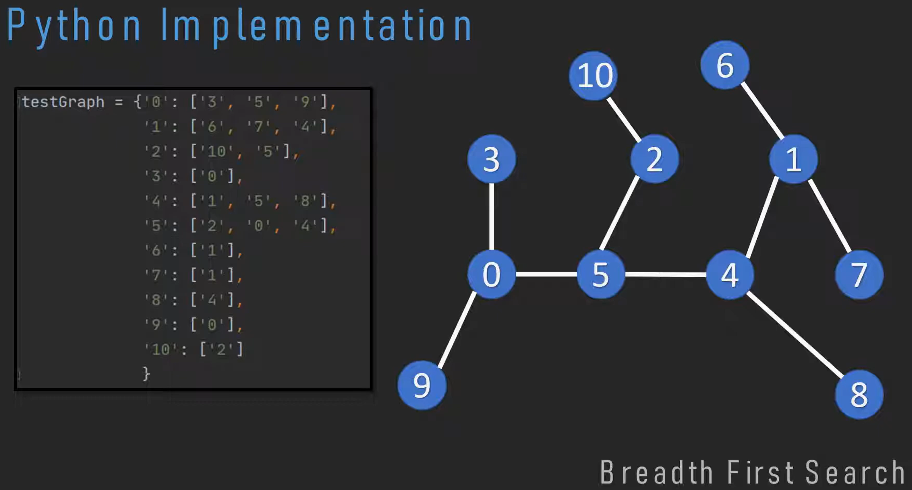

## 6. Dijkstra's Shortest Path
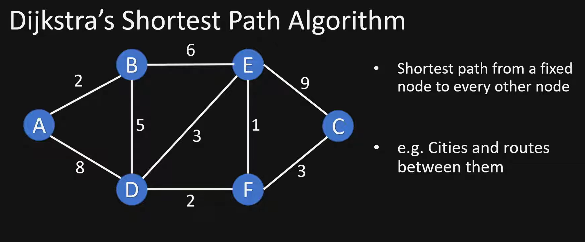
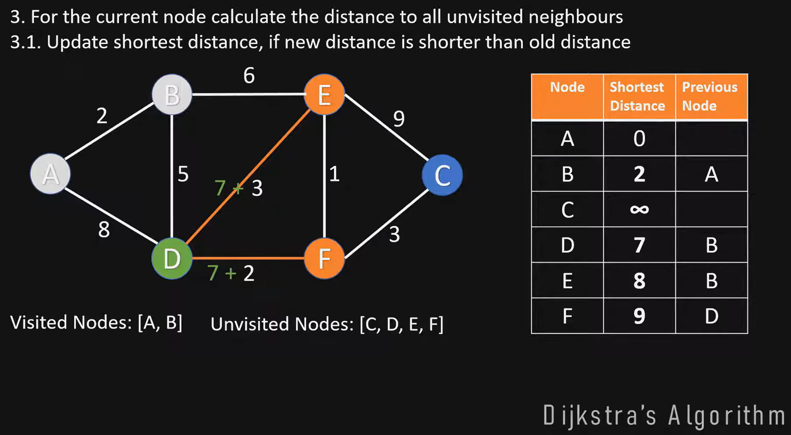
